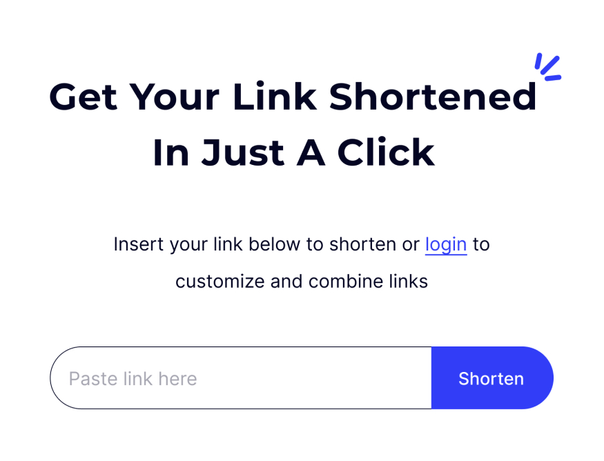

# Zipo-client - Link Management and Shortening Solution

Zipo-client is an all-in-one link management and shortening solution that empowers users to optimize, track, and manage their links effortlessly. Whether you're a marketer, entrepreneur, or social media enthusiast, zipo-client provides the tools you need to drive engagement, increase conversions, and take control of your online journey.

## Features

- **Effortless Link Shortening:** Say goodbye to long, clunky URLs that clutter your messages. With zipo-client, you can instantly shorten any link into a sleek, concise format that captivates your audience. Share your content seamlessly across all platforms.

- **Advanced Analytics:** Gain invaluable insights into your link performance. zipo-client's powerful analytics dashboard provides real-time data on click-through rates, geographical distribution, and user behavior. Unleash the full potential of your links with data-driven decision-making.

- **Branded Links:** Build trust and boost brand recognition with personalized branded links. Customize your short URLs to reflect your unique identity. Strengthen your online presence and establish credibility with every click.

- **Link Management Made Easy:** Manage all your links from a single, intuitive dashboard. Organize, categorize, and track your links effortlessly. Stay on top of your campaigns with smart link grouping and scheduling features. Save time and maximize your productivity.

- **Secure and Reliable:** Rest easy knowing that your links are in safe hands. zipo-client employs cutting-edge security measures to protect your data and ensure seamless performance. Our rock-solid infrastructure guarantees 99.9% uptime, so you can focus on what matters most - your success.

## Installation

To install and run zipo-client locally, follow these steps:

1. Clone the repository: `git clone https://github.com/salafidevelopers/zipo-client.git`
2. Navigate to the project directory: `cd zipo-client`
3. Install dependencies: `npm install`
4. Start the application: `npm start`

## Usage

1. Sign up for a zipo-client account on our website.
2. Log in to your account and access the dashboard.
3. Start shortening your links by pasting the original URL into the provided field.
4. Customize your links with branding options if desired.
5. Monitor link performance through the analytics dashboard.
6. Manage and organize your links effectively from the centralized dashboard.

## Contributing

We welcome contributions from the community to enhance LinkSwift. To contribute, please follow these steps:

1. Fork the repository.
2. Create a new branch: `git checkout -b my-feature`
3. Make your changes and commit them: `git commit -m 'Add new feature'`
4. Push to the branch: `git push origin my-feature`
5. Submit a pull request.

Please ensure your code adheres to the existing code style and includes relevant tests.

## License

This project is all right reserved by Zipo [License](LICENSE).

## Contact

If you have any questions, suggestions, or feedback, feel free to reach out to our team at support@zipo.netlify.app. We'd love to hear from you!

Visit our website: [https://zipo.netlify.app](https://zipo.netlify.app)
